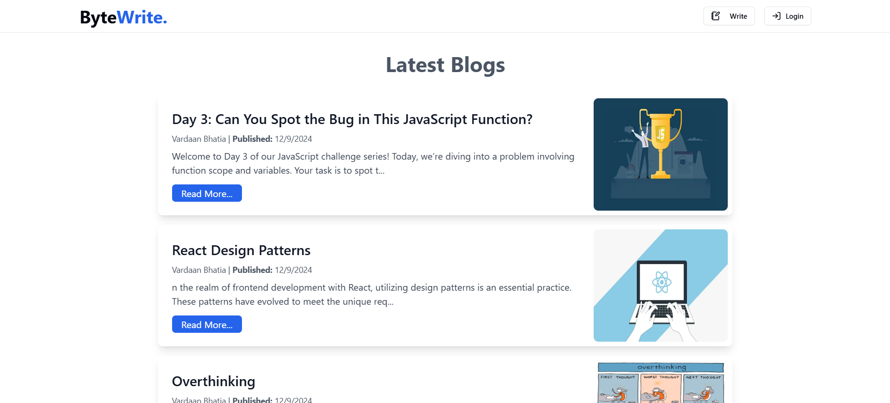

# ByteWrite

**ByteWrite** is a modern, full-stack MERN blog application designed for tech enthusiasts, developers, and writers to share their thoughts, tutorials, and news about technology.

## Features

- **User Authentication**: Secure JWT-based authentication for users to sign up, log in, and manage their accounts.
- **Image Uploads**: Users can upload images for blog posts using **Multer** and **Cloudinary** for cloud storage.
- **CRUD Operations**: Full Create, Read, Update, and Delete functionality for blog posts, comments, and user profiles.
- **State Management**: **Redux Toolkit** for efficient state management across the app.
- **Responsive UI**: Built with **React** and **TypeScript**, ensuring a smooth and user-friendly experience across devices.
- **Secure**: Built with **JWT** for secure user authentication.

## Technologies Used

- **Frontend**: React, TypeScript, Redux Toolkit
- **Backend**: Node.js, Express.js
- **Database**: MongoDB (MERN stack)
- **Authentication**: JWT (JSON Web Tokens)
- **File Upload**: Multer for handling file uploads
- **Cloud Storage**: Cloudinary for hosting uploaded images
- **Styling**:Shadcn and Tailwind CSS.
